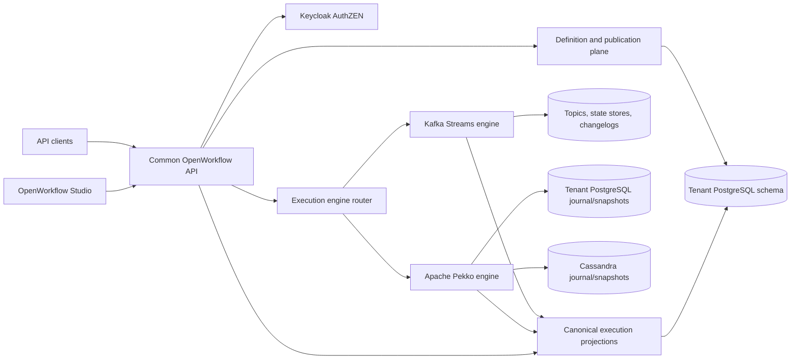

# ForwardMeasure OpenWorkflow Unification and Enhancement Plan

**Project:** `forwardmeasure-openworkflow`  
**Status:** Proposed for product-owner approval  
**Created:** 2026-08-17T12:53:58-04:00  
**Delivery intent:** Establish a working unified vertical slice as quickly as
possible, then complete both engines against one acceptance contract.

**Architecture authority:** [PROJECT_MANIFESTO.md](PROJECT_MANIFESTO.md). This
plan controls implementation order and gates; the manifesto controls product
scope, module boundaries, and architectural decisions.

## 1. Mandate

`forwardmeasure-openworkflow` will become the single ForwardMeasure workflow
product. It will consolidate the useful parts of
`openworkflow-kafka-streams` (OKS) and `openworkflow-actor-engine` (OAE), provide
one product model and user experience, and retain Kafka Streams and Apache
Pekko as independently selectable execution engines.

The project is complete only when it provides:

1. one definition, validation, immutable revision, review, approval, and
   publication model;
2. one tenant-aware security and authorization model based on Keycloak
   Organizations and Keycloak AuthZEN;
3. one public API and canonical execution/query model;
4. Kafka Streams and Pekko engines passing the same semantic and lifecycle
   contracts;
5. PostgreSQL-backed product data in a schema per tenant;
6. PostgreSQL and Cassandra persistence options for the Pekko engine;
7. Quarkus, Spring Boot, and Micronaut distributions with equivalent behavior;
8. a Maven module containing a shared Studio application, hosted by all three
   frameworks;
9. Maven-built images and repeatable Helm/Helmfile/Kustomize deployment;
10. complete start, pause, resume, and cancel behavior; and
11. executable evidence for the complete Open Workflow `1.0.3` surface.

This is consolidation, not a third greenfield engine. Existing code is copied
only after its behavior, boundaries, dependencies, tests, and provenance have
been reviewed. The new repository becomes authoritative; neither source
repository remains a runtime dependency.

## 2. Locked decisions

The following decisions do not need to be reopened during implementation.

### 2.1 Product and engine boundary

- Definition admission, validation, compilation, governance, publication,
  authorization, public APIs, Studio, audit, and canonical queries are common.
- Kafka Streams and Pekko implement a common execution-engine SPI.
- An execution is assigned one engine when it starts and remains pinned to that
  engine for its lifetime.
- Engine choice is made by trusted deployment or tenant policy, recorded on
  the execution, and is not an untrusted request-body override.
- Engine-specific events, snapshots, offsets, topics, state stores, journals,
  and projection checkpoints remain engine-specific.
- The common query model reports the same lifecycle and workflow concepts for
  both engines without pretending their internal storage formats are equal.

### 2.2 Open Workflow and Java SDK version

- The product is pinned to Open Workflow schema version `1.0.3`, packaged by
  `io.serverlessworkflow` Java SDK `7.29.0.Final`.
- ForwardMeasure owns the Maven parent and imports the upstream BOM; it does not
  inherit `serverlessworkflow-parent`.
- The build records and tests the exact SDK artifact and embedded `1.0.3`
  schema digest.
- Dependency automation must not upgrade the SDK or specification version.
  Moving beyond `1.0.3` requires a future explicit product decision and is not
  part of this plan.

### 2.3 Tenancy and persistence

- There is no shared application tenant table and no shared tenant data
  schema.
- Each tenant has its own PostgreSQL schema containing the common product
  tables.
- PostgreSQL engine-specific tables are conditionally installed into that same
  tenant schema when the applicable engine/profile is enabled.
- Tenant context comes from the authenticated Keycloak Organization and is
  carried through commands, events, effects, queries, audit records, Kafka
  records, and Pekko persistence identities.
- Database routing uses validated tenant context. An untrusted schema name or
  a process-wide mutable `search_path` is never accepted.
- Pekko with PostgreSQL stores its journal, snapshots, and projection data in
  the applicable tenant schema through the tenant-scoped persistence adapter.
- Pekko with Cassandra uses tenant-qualified persistence identifiers and a
  tenant partition component. Data is logically isolated/sharded by tenant in
  the same sense that Kafka records are isolated by tenant-qualified topic/key
  conventions.
- Kafka state stores, changelogs, and topics remain Kafka-engine persistence;
  they were never shared PostgreSQL persistence.
- PostgreSQL and Cassandra must pass the same Pekko recovery and behavioral
  contracts. Cassandra is not a replacement for the PostgreSQL product plane.

### 2.4 Pekko workflow state

- Pekko Typed Persistence is the Pekko engine's workflow finite-state machine.
- Each execution is one tenant-qualified, sharded, event-sourced entity and
  single transition authority.
- The implementation uses Pekko's event-sourced FSM pattern with typed durable
  states and state-specific command/event handlers. It will not contain a
  second home-grown generic FSM or `decide/apply` runtime beside Pekko.
- Durable timers, effect intents, pause, resume, cancellation, and recovery are
  represented by persisted events/state before acknowledgement.

### 2.5 Identity, authorization, and governance

- Keycloak `26.7.1` is the identity and authorization server baseline.
- One Keycloak Organization represents one tenant.
- Shared clients and reusable client roles are created once per environment;
  tenant-prefixed realms, clients, and roles are not generated.
- Keycloak AuthZEN Evaluation/Evaluations APIs are mandatory and fail closed.
  There is no custom RBAC engine and no local authorization fallback.
- Authorization evaluates the trusted active Organization and its nested
  organization roles. Merged top-level `realm_access` or `resource_access`
  claims never authorize a tenant action.
- Domain services enforce lifecycle invariants; AuthZEN decides whether the
  authenticated actor may request the transition.
- The definition lifecycle is:

  ```text
  DRAFT -> IN_REVIEW -> APPROVED -> PUBLISHED -> DEPRECATED
                 \-> REJECTED -> new immutable revision
  ```

- The author of a revision cannot approve or publish that same revision.
  Approval is bound to the immutable revision digest. Administrator status
  does not silently bypass this maker-checker rule.
- Initial OpenWorkflow roles are `workflow-author`, `workflow-approver`,
  `workflow-publisher`, `workflow-execution-controller`, `workflow-auditor`,
  and `workflow-administrator`.

### 2.6 Framework and configuration parity

- Quarkus, Spring Boot, and Micronaut are equally supported hosts.
- Portable application/domain modules contain no host-framework logic.
- Every public capability is exposed through all three framework bindings
  before its work package is accepted.
- Configuration files use YAML in all three distributions.
- Java is formatted with Spotless and `google-java-format`; import ordering is
  therefore Google-style and mechanically enforced.

### 2.7 Deployment boundary

- Application images are built by Maven. Documentation will not require hand
  written `docker build` commands.
- The application repository owns its namespace, charts, Helmfile releases,
  Kustomize overlays, Keycloak configuration, application migrations, and
  workloads.
- The unified namespace is `forwardmeasure-openworkflow`.
- Ingress is optional and disabled by default.
- PostgreSQL and Cassandra production profiles are genuine but optional
  deployment paths. Local/development profiles remain runnable without
  production credentials or infrastructure.
- There is no OpenShift-specific deployment path.
- `openworkflow-k8s-setup` is consumed only for cloud-infrastructure metadata:
  managed Kubernetes/network/IAM, managed PostgreSQL, and GCS/S3/Blob buckets.
  It does not create namespaces or install cluster/application services.

## 3. Target architecture



The common plane owns product truth such as published definitions and the
canonical user-facing execution view. Each engine owns the durable facts
needed to execute and recover its workflows.

## 4. Target Maven structure

The initial reactor will use the following capability-oriented structure. A
module is added only when its work package supplies real behavior and tests.

```text
forwardmeasure-openworkflow/
  pom.xml
  openworkflow-bom/
  openworkflow-model/
  openworkflow-definition/
  openworkflow-expression-jq/
  openworkflow-authorization/
    openworkflow-authorization-api/
    openworkflow-authorization-authzen/
    openworkflow-authorization-testkit/
  openworkflow-tenant-provisioning/
  openworkflow-definition-management/
    openapi-specifications/
    ...-application/
    ...-jaxrs/
    ...-jpa/
    ...-contract-tests/
    api-language-bindings/
      java/models/
      java/client-apachehttp/
      java/server-jaxrs/
      typescript/client/
      python/client/
  openworkflow-engine/
    openworkflow-engine-api/
    openworkflow-engine-contract-tests/
    openworkflow-engine-pekko/
      openworkflow-engine-pekko-core/
      openworkflow-engine-pekko-persistence-postgresql/
      openworkflow-engine-pekko-persistence-cassandra/
    openworkflow-engine-kafka-streams/
  openworkflow-execution-management/
    openapi-specifications/
    ...-application/
    ...-jaxrs/
    api-language-bindings/
  openworkflow-execution-query/
    openapi-specifications/
    ...-api/
    ...-core/
    ...-jpa/
    ...-contract-tests/
  openworkflow-eventing/
  openworkflow-operation-adapter/
  openworkflow-human-task/
  openworkflow-migrations/
  openworkflow-studio/
    webapp/
  framework-bindings/
    quarkus/
      openworkflow-quarkus-binding/
      openworkflow-quarkus-service/
      openworkflow-studio-quarkus/
    spring/
      openworkflow-spring-binding/
      openworkflow-spring-service/
      openworkflow-studio-spring/
    micronaut/
      openworkflow-micronaut-binding/
      openworkflow-micronaut-service/
      openworkflow-studio-micronaut/
  openworkflow-architecture-tests/
  openworkflow-conformance-tests/
  openworkflow-acceptance-tests/
  deploy/
    charts/
    helmfiles/
    kustomize/
```

`openworkflow-execution-query` is the umbrella for canonical query APIs,
projection consumers, and query storage adapters. Pekko journal and snapshot
configuration belongs to `openworkflow-engine-pekko`, not to the query module.

## 5. Source consolidation policy

Before copying code, WP0 creates `docs/source-provenance.md` with each adopted
source path, destination, reason, substantive changes, and test evidence.

| Capability | Starting source | Treatment |
|---|---|---|
| Official model/reader boundary | OAE model boundary and current upstream SDK | Adopt the official SDK types; remove duplicate generated public models. |
| Validation/compiler/jq | Primarily reviewed OKS definition, computation, and jq code | Extract deterministic portable behavior; remove Kafka and framework coupling. |
| Definition/API language bindings | Best contract portions from both projects | Define one OpenAPI contract, regenerate clients, and delete duplicate contracts. |
| Definition persistence | OKS JPA plus OAE PostgreSQL contracts | Reconcile into one immutable tenant-schema repository. |
| Pekko runtime | OAE actor runtime | Keep Pekko Typed Persistence/FSM behavior; remove provisional custom FSM paths. |
| Kafka runtime | OKS runtime/durable-processing modules | Place behind the common engine SPI and tenant/query contracts. |
| Query/projections | OAE query shape plus useful OKS query behavior | Produce one canonical projection contract with engine-specific consumers. |
| Events, operations, human tasks | Reviewed OKS modules plus OAE protocol adapters | Port after the core vertical slice; retain only specification-backed behavior. |
| Studio | OAE Maven Studio shape plus useful OKS Studio code | One Maven-built web application with three thin hosts. |
| Framework bindings | OAE symmetry and useful OKS adapters | Three equivalent, thin, YAML-configured hosts. |
| Deployment | OAE/OKS lessons and Data Fabric Helmfile layout | Rebuild for the unified topology; do not copy architecture-specific RBAC, ports, or overlays blindly. |
| Security | Keycloak Organizations/AuthZEN decisions | Do not copy Data Fabric's embedded authorization implementation. Preserve only role/action requirements worth retaining. |

The referenced `docs/implementation-failure-report.md` is not currently present
under the OKS repository. Its absence is recorded rather than silently
inventing its conclusions; the available OKS code, tests, manifestos, runtime
invariants, and deployment documents remain review inputs.

## 6. Common data model

Every tenant schema begins with one versioned common migration set. Initial
logical tables are:

- `workflow_definition` — stable workflow identity;
- `workflow_revision` — immutable source, resolved document, schema/SDK
  version, compiler profile, and digests;
- `workflow_validation` — reproducible schema and semantic results;
- `workflow_review` — submission, approval/rejection, actor, reason, and digest;
- `workflow_publication` — published revision and lifecycle history;
- `workflow_execution` — canonical identity, selected engine, definition
  revision, lifecycle, timestamps, and optimistic version;
- `workflow_execution_projection` — canonical current execution view;
- `workflow_execution_history` — canonical user-facing transition history;
- `workflow_command_receipt` — idempotency and accepted/rejected command audit;
  and
- `workflow_authorization_audit` — decision identifier and relevant trusted
  context without copying sensitive token contents.

Engine-specific migrations are conditional:

- Pekko/PostgreSQL journal, snapshot, durable-state, and projection-offset
  tables;
- Kafka engine outbox/inbox or projection metadata only where the selected
  design requires PostgreSQL coordination; and
- no Cassandra or Kafka internal tables masquerading as common product tables.

Published revisions are immutable. A rejected or subsequently edited workflow
creates a new revision. An execution records the exact revision digest and
engine, making replay and audit independent of later publication changes.

## 7. Ordered implementation plan

Work proceeds in this order. A package is not complete until its focused tests
and stated Kubernetes checkpoint pass.

### WP0 — Reproducible reactor and evidence baseline

1. Create the parent reactor, BOM, Java/toolchain policy, Maven wrapper, and
   shared plugin management.
2. Import `com.forwardmeasure.jpa:forwardmeasure-jpa-bom:1.0.0` and select its
   portable tenancy, identity, Liquibase, contract-test, and three framework
   integration modules; do not copy those facilities locally.
3. Configure Spotless/Google Java Format, import ordering, compiler warnings,
   dependency convergence, license checks, ArchUnit, and generated-source
   exclusions.
4. Create the target module skeleton only through WP1; avoid a forest of empty
   modules.
5. Inventory OKS/OAE code and tests into the provenance ledger.
6. Pin SDK `7.29.0.Final` and test that its embedded schema remains exactly
   Open Workflow `1.0.3` with the recorded digest.
7. Establish focused, capability-gate, and full-suite Maven profiles.

**Exit:** clean checkout compiles; formatter and architecture tests run; the
source inventory identifies adopt, refactor, or discard for every candidate
module. No cluster deployment occurs at this gate.

### WP1 — Common specification model, compiler, and engine contracts

1. Adopt the official SDK reader/types as the syntax boundary.
2. Consolidate size checks, duplicate-key rejection, schema validation,
   semantic validation, resource resolution, jq expressions, immutable
   compilation, and digest calculation.
3. Define portable definition coordinates, tenant/actor context, execution
   identity, command envelopes, lifecycle states, errors, effects, timers, and
   canonical query records.
4. Define `ExecutionEngineProvider`, engine selection, start/control command,
   event/projection, and health/readiness contracts.
5. Create one engine contract-test kit that both engines must implement.

**Focused tests:** official example/invalid corpus, compiler golden files,
digest determinism, serialization round trips, architecture boundaries, and a
contract-test fake used only by tests.

**Exit:** no engine, persistence, HTTP, or framework type leaks into the
portable contracts.

### WP2 — Tenant provisioning and AuthZEN authorization

1. Implement Keycloak Organization provisioning/reconciliation, shared client
   roles, and the OpenWorkflow capability pack.
2. Implement tenant-schema creation and common migration application without a
   shared tenant table.
3. Build the AuthZEN client adapter, decision context, fail-closed behavior,
   evaluation caching rules, batch evaluation for Studio pages, and audit
   correlation.
4. Define resources and actions for definition create/read/update/delete,
   validate, submit/withdraw, approve/reject, publish/deprecate, execution
   start/pause/resume/cancel, and audit/query access.
5. Version the Keycloak/AuthZEN configuration and policy tests in this
   repository.

**Focused tests:** active-organization isolation, role leakage rejection,
missing/failed AuthZEN rejection, action matrix, schema routing, idempotent
reconciliation, and no privilege escalation when capability packs are added.

**Kubernetes K1:** Helmfile creates `forwardmeasure-openworkflow`, deploys or
connects to Keycloak according to the selected profile, reconciles AuthZEN
configuration, provisions two test Organizations/schemas, and proves
cross-tenant denial. Ingress remains disabled.

### WP3 — Governed definition vertical slice

1. Implement the common PostgreSQL entities, repositories, and persistence
   services on `forwardmeasure-jpa`; compose the application changelog with
   `forwardmeasure-jpa-liquibase` under the single deployment-owned migration
   runner.
2. Implement application services for create, validate, revise, submit,
   withdraw, approve, reject, publish, deprecate, retrieve, and list.
3. Enforce author-not-approver/publisher and immutable digest binding.
4. Publish one OpenAPI source contract and generate separate Java models,
   Apache HttpClient, JAX-RS server interfaces, TypeScript client, and Python
   client artifacts. Generated code is never hand-edited.
5. Implement the generated JAX-RS interfaces in a portable transport adapter
   that depends only on application services.
6. Expose the same portable resources through Quarkus, Spring Boot, and
   Micronaut bindings and executable service modules using YAML configuration
   and the corresponding `forwardmeasure-jpa` adapter.

**Focused tests:** repository contracts with PostgreSQL Testcontainers,
lifecycle transition matrix, maker-checker, tenant isolation, OpenAPI drift,
and identical framework acceptance tests.

**Kubernetes K2:** Maven builds the three service images. Separate Helmfile
selectors deploy each framework distribution against the same chart contract.
For each distribution: admit an invalid definition and observe rejection;
admit a valid definition; create a second revision; approve and publish it;
restart the pod; retrieve the exact published digest.

### WP4 — Canonical execution and query plane

1. Implement execution admission, engine selection, command receipts, and the
   canonical execution repository.
2. Implement projection ports and idempotent engine-to-canonical projection
   handling.
3. Define common execution/query OpenAPI contracts and generated clients.
4. Ensure an execution can start only from an authorized, published immutable
   revision.
5. Add optimistic versioning, correlation, pagination, filtering, and audit.

**Focused tests:** engine selection/pinning, duplicate starts, projection
idempotency/order, stale command rejection, tenant isolation, and framework API
parity.

**Exit:** both real engines can be plugged in without changing common APIs or
tables.

### WP5A — Pekko Milestone 1 vertical slice

1. Port/refactor the OAE actor runtime behind the engine SPI.
2. Implement each workflow execution as a clustered, tenant-qualified Pekko
   event-sourced FSM with enforced replies and state-specific handlers.
3. Implement the minimum representative semantics required to execute a
   published workflow end to end: input/output/export, `do`, `set`, conditions,
   jq expressions, completion/failure, and deterministic persisted transitions.
4. Persist effect intents before external work and project Pekko events to the
   canonical query model.
5. Implement PostgreSQL journal/snapshot routing within the tenant schema and
   recovery tests.
6. Implement Cassandra journal/snapshot configuration with tenant-qualified
   partitioning and the identical recovery contract.

**Focused tests:** Pekko behavior testkit for every state/command pair, replay
from every event prefix, serialization golden files, duplicate commands,
process termination/recovery, PostgreSQL/Cassandra parity, and projection
rebuild.

**Kubernetes K3A:** deploy a three-node Pekko runtime first with PostgreSQL,
then with Cassandra; publish and start a workflow; terminate the owning pod
mid-execution; verify recovery, completion, query visibility, and tenant
isolation.

### WP5B — Kafka Streams Milestone 1 vertical slice

1. Port the reviewed OKS runtime and durable-processing behavior behind the
   same engine SPI.
2. Remove duplicated definition, tenant, API, authorization, query, and Studio
   implementations.
3. Use tenant-qualified Kafka keys/topics and persist the selected engine in
   the common execution record.
4. Project Kafka engine changes into the same canonical query model.
5. Make the representative workflow from WP5A produce the same observable
   result and lifecycle history.

**Focused tests:** shared engine contract kit, Kafka Streams topology tests,
real Kafka Testcontainers, rebalance/restart recovery, duplicates/out-of-order
input, projection rebuild, and cross-tenant isolation.

**Kubernetes K3B / Milestone 1:** select the Kafka profile without changing the
public API or Studio contract. Repeat the definition, approval, publication,
start, disruption, completion, and query journey. Milestone 1 is accepted when
this journey passes for both engines, all three hosts, PostgreSQL product data,
and both Pekko persistence profiles.

### WP6 — Studio authoring and observability (Milestone 2)

1. Consolidate Studio into the `openworkflow-studio` Maven module with one
   webapp and three thin framework hosts, following the established Data Fabric
   portal layout.
2. Provide lossless YAML/JSON editing, validation diagnostics, revision diff,
   submission/review/approval/publication views, and role-aware actions.
3. Provide definition visualization and execution list/detail/timeline views
   from canonical APIs; never read engine stores directly.
4. Use AuthZEN batch evaluation to decide visible/enabled actions while keeping
   server-side authorization authoritative.
5. Produce presentation-quality Draw.io source plus exported SVG diagrams for
   system context, component architecture, definition governance, execution,
   persistence, security, and deployment.

**Focused tests:** component/unit tests, API-client compatibility, round-trip
losslessness, accessibility checks, Playwright journeys for each role, and
framework host parity.

**Kubernetes K4 / Milestone 2:** deploy Studio through Helmfile, with optional
ingress enabled only in the acceptance overlay. Complete author, independent
approver/publisher, start, and execution-observation journeys against both
engines.

### WP7 — Durable workflow control (Milestone 3)

1. Implement start, pause, resume, and cancel in the common API and both engine
   providers.
2. Pekko persists `PAUSING/PAUSED` and `CANCELLING/CANCELLED` transitions and
   retains cursor/pending-effect state across recovery.
3. Kafka Streams implements observably equivalent durable control semantics
   without copying Pekko's internal state representation.
4. Define safe boundaries, late effect/timer handling, idempotency, and illegal
   transition responses once in the common behavioral contract.
5. Add Studio controls and lifecycle visualization.

**Focused tests:** full state/command matrix, duplicate controls, pause/restart,
cancel/restart, late observations, concurrent controls, completed-workflow
rejection, and parity across engines/backends/frameworks.

**Kubernetes K5 / Milestone 3:** run long/waiting workflows, pause and relocate
their owner, resume to completion, and separately cancel while effects are in
flight. Prove cancelled executions cannot be resurrected.

### WP8 — Complete semantics and adapters (Milestone 4 / 100 percent)

Implement remaining specification capabilities in dependency order, adding
each to the common compiler and engine contract before either engine claims it:

1. complete task composition, switch/conditional, loops, fork/concurrency, and
   nested scopes;
2. durable waits, schedules, timeouts, retries, backoff, errors, and recovery;
3. event consumption/production and correlation;
4. call semantics including HTTP/OpenAPI, gRPC, AsyncAPI protocols, workflows,
   and specification-defined agent protocols;
5. compensation and cancellation interactions;
6. secrets/authentication/runtime expressions and resource catalogs;
7. human task behavior where normative or explicitly adopted as a product
   extension; and
8. complete canonical query/history and Studio visualization for every added
   capability.

Each capability follows the same micro-order: syntax/validation -> immutable
plan -> common behavioral fixtures -> Pekko -> Kafka Streams -> projections ->
three framework APIs -> Studio -> Kubernetes disruption case.

**Milestone 4 acceptance:** the Open Workflow `1.0.3` feature/evidence ledger
has no unsupported or inspection-only row; official CTK/examples and the
ForwardMeasure conformance corpus pass for both engines;
PostgreSQL/Cassandra Pekko parity passes; all three hosts pass; recovery,
tenant isolation, AuthZEN, API, Studio, and Kubernetes suites pass; and the
final full suite is green.

Milestone 4—not Milestones 1, 2, or 3—is the milestone that establishes
100-percent implementation.

### WP9 — Operational hardening and releases

1. Complete readiness/liveness/startup probes, graceful shutdown, migration
   safety, rolling upgrades, serialization compatibility, projection rebuild,
   backup/restore, and disaster-recovery runbooks.
2. Add OpenTelemetry metrics/traces/log correlation without coupling domain
   code to a vendor.
3. Add network policies, pod security, service accounts, disruption budgets,
   anti-affinity, resource settings, and secret references to the chart.
4. Provide local, development, CI, production-PostgreSQL, and
   production-Cassandra Helmfile/Kustomize profiles. Production profiles are
   optional and require real values only when deliberately selected.
5. Create versioned release notes, compatibility matrix, upgrade path, and
   rollback procedure.

Performance/load evidence is measured after functional correctness. This plan
does not invent scale-target approval JSON, approver timestamps, image digests,
Sigstore identities, NVD keys, live URLs, or cluster credentials as coding
prerequisites. Such inputs are supplied only when an explicitly selected
release or environment genuinely requires them.

### WP10 — Entity Intelligence capability-pack enhancement

Entity Intelligence extends the tenant Organization; it does not redefine or
overload the OpenWorkflow roles.

1. Generalize the WP2 reconciler to
   `reconcileCapabilityPack(OPENWORKFLOW)` and
   `reconcileCapabilityPack(ENTITY_INTELLIGENCE)`.
2. Define reusable Entity Intelligence client roles based on the current
   product capabilities: dossier, entity, evidence, information extraction,
   ingestion, investigation, resolution, screening, and reference-population
   approval.
3. Create empty Organization role groups when the pack is enabled; never
   auto-assign users or escalate privilege.
4. Map broad roles to fine-grained Entity Intelligence AuthZEN resources and
   actions. Preserve maker-checker restrictions for reference-population
   approval.
5. Replace the broad human-visible `workflow-internal` role with a narrow
   workload identity such as `entity-intelligence-workflow-invoker`.
6. Store the stable tenant DID/identifier association in trusted Organization
   context; never expose a database schema selector to tokens or clients.

This work may begin after WP2's capability-pack contract is stable, but it does
not block OpenWorkflow Milestones 1-4. No runtime dependency on the retiring
Data Fabric authorization code is introduced.

### WP11 — Migration and retirement of OKS/OAE standalones

1. Publish migration maps for Maven coordinates, APIs, configuration, database
   objects, Kafka topics, Pekko persistence, Helm values, and Studio URLs.
2. Import existing definitions as immutable revisions with verified digests
   and publication history where evidence exists.
3. Support existing executions to completion in their original engine unless a
   separately proven migration mechanism exists; do not translate live engine
   internals speculatively.
4. Run shadow/read comparison where existing deployments are available.
5. Stop publishing old artifacts only after unified replacements pass their
   gates and downstream consumers have migrated.
6. Mark OKS and OAE read-only, retain provenance/history, and archive them only
   after rollback windows close.

## 8. Testing cadence

The suite is deliberately tiered to maximize implementation time without
weakening final evidence.

### Inner loop — on affected code

- Spotless formatting/check;
- compile the affected module and direct dependents;
- focused unit/behavior/repository test class; and
- generated-source or contract drift check when relevant.

### Work-package gate — once per completed capability

- affected Maven module family;
- shared contract tests against the newly completed adapters;
- relevant Testcontainers integration;
- three framework acceptance tests; and
- the stated Kubernetes checkpoint.

### Milestone gate

- Milestone 1: complete definition-to-execution journey for both engines,
  frameworks, and Pekko persistence profiles;
- Milestones 2 and 3: full affected product journey plus prior milestone smoke;
- Milestone 4: the complete conformance, integration, recovery, security,
  framework, persistence, Studio, and Kubernetes matrix; and
- release candidate: one final clean-checkout full-suite run after final fixes.

The full regression suite is not run after every edit. A second full run is
required only when a final repair changes shared contracts, serialization,
persistence, tenancy/security, or engine behavior.

## 9. Incremental deployment profiles

All deployment operations are Maven/Helmfile driven. Kustomize supplies
environment overlays where it materially improves patching; it does not become
a second release manager.

| Checkpoint | Components | Purpose |
|---|---|---|
| K1 | Namespace, Keycloak/AuthZEN configuration, migrations | Prove tenant/security foundation. |
| K2 | Definition service in each framework | Prove governed definition plane. |
| K3A | Pekko runtime and PostgreSQL/Cassandra profiles | Prove first engine and recovery. |
| K3B | Kafka Streams runtime and Kafka profile | Prove engine interchangeability and Milestone 1. |
| K4 | Studio | Prove author/reviewer/operator journeys. |
| K5 | Control-capable runtimes | Prove pause/resume/cancel under disruption. |
| K6 | Complete adapters/semantics and optional ingress | Prove Milestone 4. |
| K7 | Hardened production overlays | Prove release operations. |

Expected commands will be of this form once the modules exist:

```bash
./mvnw -Pcontainer -pl framework-bindings/quarkus/openworkflow-quarkus-service -am package
helmfile -e development -l checkpoint=K3A apply
helmfile -e development -l checkpoint=K3A test
```

The exact command and value schema will be generated and tested with the
deployment implementation. Operators will not have to hand-build images or
hand-create namespaces.

## 10. Immediate execution queue

Once this plan is approved, implementation starts without another discovery
phase:

1. create WP0 parent/BOM/build-quality configuration;
2. generate `docs/source-provenance.md` from the two source repositories;
3. move the official model boundary, jq evaluator, and reviewed compiler tests
   into WP1 modules;
4. define the common engine, tenant, actor, lifecycle, and query contracts;
5. add contract-test fixtures before moving either runtime;
6. implement Keycloak Organization/AuthZEN and tenant-schema foundations;
7. deliver the governed definition API through all three framework hosts; and
8. proceed immediately to the Pekko, then Kafka, Milestone 1 slices.

The first visible product checkpoint is K2; the first executable workflow is
K3A; the first genuinely unified two-engine product is K3B/Milestone 1.

## 11. Approval and change control

Approval means the mandate, locked decisions, work-package order, milestones,
and acceptance gates become the implementation authority. Routine technical
choices within those boundaries do not require repeated approval.

Material changes—dropping an engine, persistence backend, framework,
maker-checker rule, AuthZEN, schema-per-tenant isolation, specification scope,
or milestone acceptance gate—must be recorded as an amendment to this document
before implementation silently diverges.
